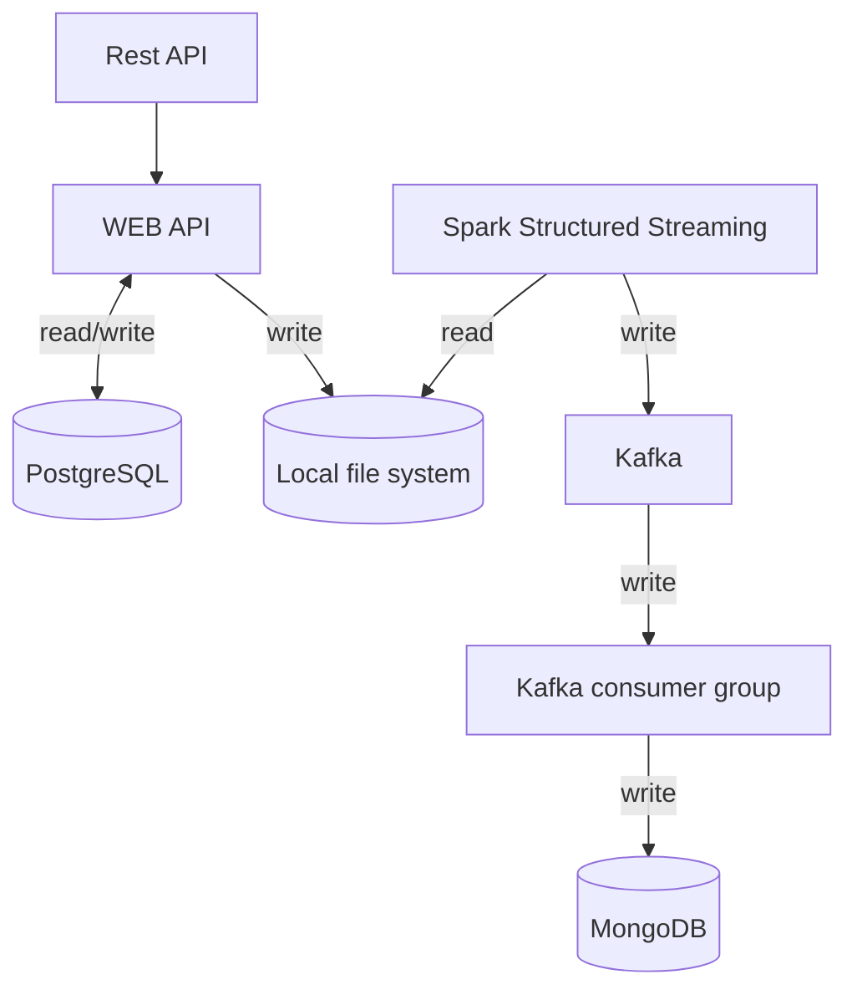

# Educational-Process-Management-System

Схема платформы приложения

```mermaid
graph TD
    A[Rest API]
    B[WEB API]
    C[(PostgreSQL)]
    D[(Local file system)]
    E[Spark Structured Streaming]
    F[Kafka]
    G[Kafka consumer group]
    H[(MongoDB)]

    A -->   B
    B <-->  |read/write| C
    B -->   |write| D
    E -->   |read| D
    E -->   |write| F
    F -->   |write| G
    G -->   |write| H
```

