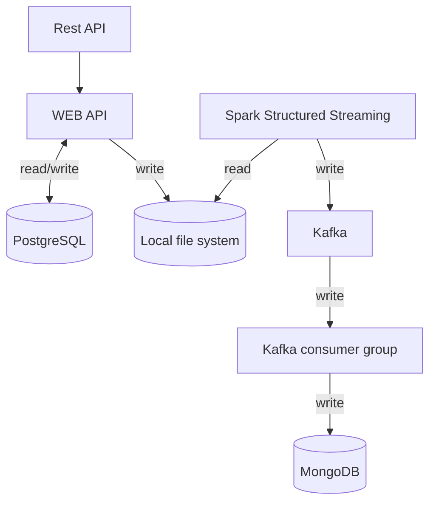

# Educational-Process-Management-System

Схема платформы приложения


## Docker

Docker-конфигурации для контейнеризации компонентов приложения.

> **Запустить контейнеры**
> ```shell
> docker compose up
> ```

> **Остановить контейнеры и удалить хранилища**
>
> *Используется для полного перезапуска системы*
> ```shell
> docker compose down -v
> ```

> **Проверка сохранения в локальное хранилище
> ([data-exports](./data_exports)) студентов**
>
> *Отправляет `curl` запрос на` Web Api`*
> ```shell
> curl -X POST http://localhost:8080/api/students \
>     -H "Content-Type: application/json" \
>     -d '{
>           "firstName": "Тест",
>           "lastName": "Тестов",
>           "email": "test.testov@example.ru",
>           "enrollmentDate": "2024-09-01"
>         }'
> ```