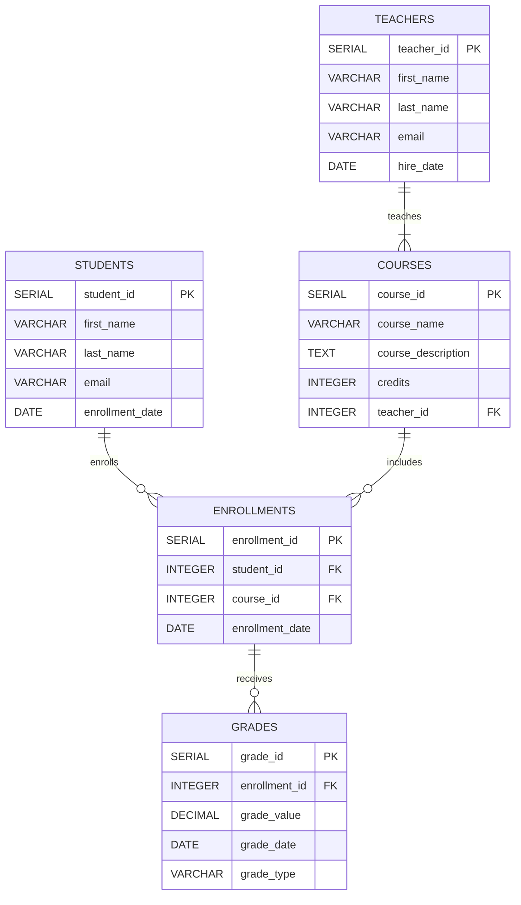

## Databases

> **Перейти в БД Postgres**
> ```shell
> docker exec -it education_postgres psql -U edu_user -W education_db
> ```

Содержит конфигурации и скрипты для баз данных.

- **postgresql/** — настройки и скрипты для PostgreSQL.
- **mongodb/** — настройки и скрипты для MongoDB.

